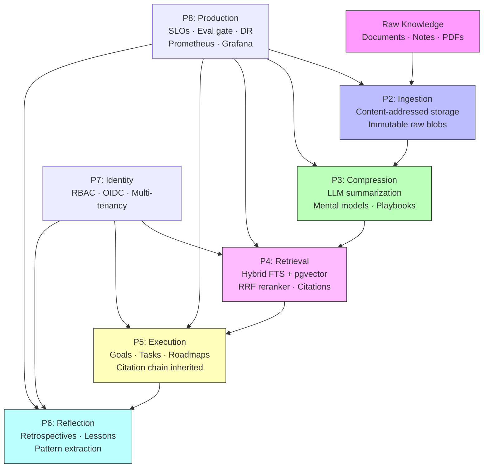
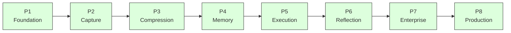

# I Built an AI-Powered Second Brain for Engineering Teams — Here's the Architecture

*Why institutional memory keeps dying, and what a production-grade solution actually looks like.*

---

Every engineering team I've been part of has the same problem. You ship a feature. Six months later someone asks why a particular decision was made. The person who made it has left. The Slack thread is buried. The Confluence page hasn't been touched since 2023. You're starting from scratch.

This is not a process problem. It's an **infrastructure problem**. We invest heavily in code infrastructure — version control, CI/CD, observability — but we treat the knowledge that produced that code as ephemeral. It shouldn't be.

I spent six months building ECI: **Engineering Cognition Infrastructure** — a self-hosted, AI-powered system that captures, compresses, retrieves, and compounds institutional knowledge. This post explains why I built it, the architectural principles that shaped it, and the eight-phase journey from an empty repo to a GA-ready system.

---

## The Problem in Concrete Terms

Here's what institutional memory loss actually costs:

- A senior engineer spends 3 days debugging a system that a post-mortem from 18 months ago could have explained in 10 minutes.
- A new hire makes the same architectural mistake the team made 2 years ago — the reasoning that led to the current approach was never written down.
- A retrospective surfaces the same three lessons it surfaced last quarter, because the previous lessons weren't structured, weren't stored, and weren't searchable.

The solution isn't better meetings or more documentation. It's treating knowledge as a **first-class engineering artifact** with the same rigor we apply to code.

---

## The Architecture: Six Layers, One Product

### Layer 1 — Ingestion (P2)

Every document, note, and PDF that enters ECI is:
1. SHA-256 hashed (content-addressed storage)
2. Stored immutably as a raw blob (`LocalBlobStore` or `S3BlobStore`)
3. Parsed into a normalized `Document` or `Note` record with full provenance: `source`, `author`, `captured_at`, `ingested_at`
4. Idempotency-checked: re-ingesting identical content returns the existing record without duplication

This is the same design principle that underlies Git — immutable, content-addressed, append-only.

### Layer 2 — Compression (P3)

Raw content is compressed into three forms:
- **Summaries**: short (1 paragraph), medium (3 paragraphs), long (detailed) — stored in Postgres, linked to source
- **Mental models**: structured claims, entities, and relationships extracted as JSONB — queryable, not just readable
- **Playbooks**: reusable procedural recipes extracted from how-to documents

The LLM is abstracted behind a `LLMProvider` Protocol. Switching from Ollama (offline) to OpenAI is a one-env-var change. No code edits. This is AP-3: cloud-enhanced, never cloud-dependent.

### Layer 3 — Retrieval (P4)

ECI uses **hybrid retrieval**: Postgres full-text search (`websearch_to_tsquery` + GIN index) combined with pgvector HNSW cosine ANN, reranked via Reciprocal Rank Fusion.

The key architectural invariant: **no answer without provenance**. Every retrieval result carries mandatory source citations. The API layer refuses to serve results without them. This is enforced at the code level, not as a convention.

### Layer 4 — Execution (P5)

Goals, tasks, and roadmaps are not standalone artifacts. They inherit the citation chain from the retrieval results that justified creating them. When you ask "why does this task exist?", the API returns the exact documents and memory entries that motivated it — tracked at creation time, deterministic, auditable.

### Layer 5 — Reflection (P6)

Periodic retrospectives analyze completed goals and tasks, extract structural lessons using the LLM, and store them in a typed lesson register. Lessons can supersede previous lessons (with an audit trail). The result: institutional memory that compounds over time rather than resetting with each quarter.

### Layer 6 — Enterprise (P7) + Production (P8)

RBAC with three roles (`admin > member > viewer`), multi-tenant isolation, OIDC SSO, per-tenant retrieval filtering, SLO monitoring, eval-gated releases, and a DR runbook. These aren't afterthoughts — they're phase commitments with ADRs written before code.

---

## Six Architectural Principles That Shaped Everything

I started by writing six principles before a single line of code. Every decision in the eight phases traces back to one of them.

**AP-1 — Memory is the product.** Everything else (APIs, LLM integration, retrieval) is in service of building useful, trustworthy memory. When a feature doesn't serve this, it gets deferred.

**AP-2 — Evidence before inference.** No generated output — summary, answer, lesson — goes out without source references, a reasoning trace, and a confidence signal. The system fails closed, not open.

**AP-3 — Offline-first. Cloud-enhanced. Never cloud-dependent.** Ollama is the default LLM runtime. pgvector is the default vector store. The system works on a laptop with no internet. Cloud is opt-in.

**AP-4 — Human-in-control.** AI recommends; humans decide. Goals and tasks aren't auto-created. Lessons aren't auto-applied. The human is always in the loop.

**AP-5 — Composable modules.** Nine packages, each with one responsibility, each under 300 lines per file. This isn't just style — it's economics. An AI coding assistant that needs to read a 2000-line `services.py` to answer a question is burning tokens on irrelevance.

**AP-6 — Long-term ownership.** Provider Protocol pattern for LLM, BlobStore Protocol for storage, offline-first retrieval — designed to avoid the situation where swapping one vendor takes three weeks of refactoring.

---

## The Eight Phases: One at a Time

Each phase has a hard dependency on the previous one and requires a signed-off exit checklist before the next begins. Phase N cannot start until Phase N-1's checklist is fully complete and recorded in the memory bank. This is RULE 4: single phase execution.

The constraint sounds bureaucratic. In practice, it prevents the common failure mode of building everything at once and finishing nothing. P1 delivers zero product value. But without P1's observability spine, P3's LLM calls have no traces. Without P2's ingestion, P4's retrieval has no corpus. The dependency graph is real.

---

## What I'd Do Differently

**Start with the evaluation framework earlier.** I defined eval contracts at each phase, but the thresholds were set during the phase rather than before. Defining "good enough" before writing code constrains scope better than any sprint planning.

**The 300-line file limit is a forcing function, not a style guide.** It forces you to decompose. When a file is approaching the limit, it's a signal that you're trying to put two responsibilities in one place. That signal is worth more than any linting rule.

**Protocol-first design pays off compounding returns.** The `LLMProvider` Protocol written in P3 made the P8 cloud-provider swap a 10-minute environment variable change. The `BlobStore` Protocol written in P2 made the P8 S3 adapter a new file, not a refactor.

---

## Technical Stack

| Layer | Choice | Why |
|-------|--------|-----|
| API | FastAPI + Pydantic v2 | Type-safe, fast, async-ready |
| ORM | SQLAlchemy 2 + Alembic | Sync preferred; migrations as code |
| Database | Postgres 16 + pgvector | HNSW for ANN + GIN for FTS in one DB |
| LLM | Ollama (default), OpenAI/Anthropic optional | Offline-first |
| Embeddings | `nomic-embed-text`, 768-dim | Free, fast, quality |
| Packaging | `uv` workspace | 10x faster than pip; lockfile guaranteed |
| Observability | OTel + Prometheus + Langfuse | Traces, metrics, LLM call visibility |

---

## The Repository

The full source is on GitHub with all 10 ADRs, eval contracts, SLO definitions, and a DR runbook. The system is GA-ready and documented.

In the next posts in this series, I'll go deep on:
- **Post 2**: The LLM abstraction pattern and why offline-first changes everything
- **Post 3**: Building a citation-first retrieval system — hybrid search, RRF, and the "no answer without provenance" invariant
- **Post 4**: From memory to action — how execution intelligence traces back to evidence
- **Post 5**: Production hardening — SLOs, eval gates, and the security CI pipeline

---

*If this resonates, follow the series. The code is open source. The architecture decisions are documented. The lessons are earned.*

---

**Tags:** `#SystemDesign` `#AIEngineering` `#Python` `#PostgreSQL` `#SoftwareArchitecture` `#MachineLearning` `#ProductionSystems`
