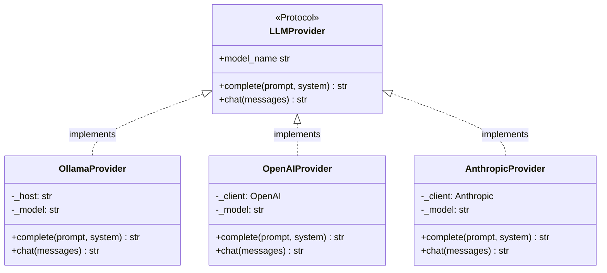
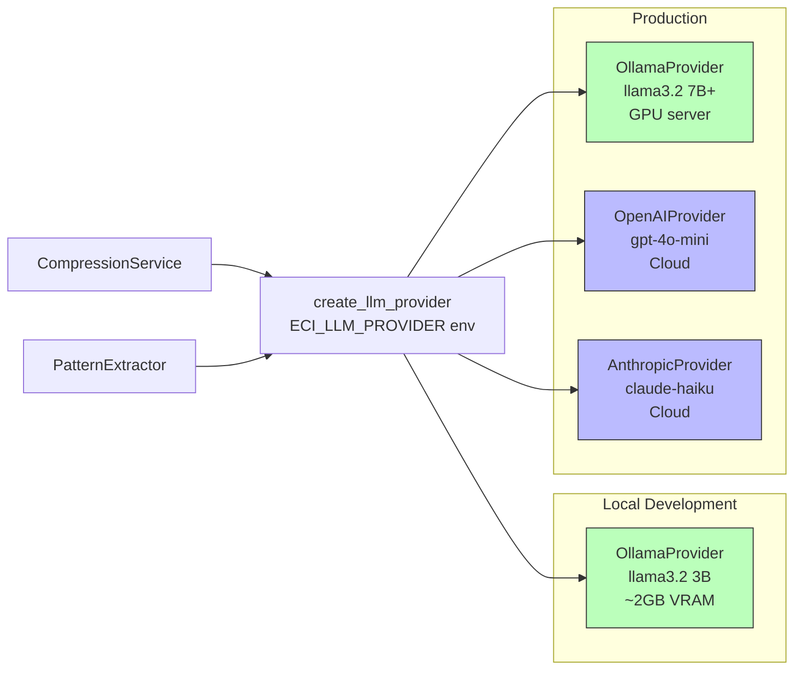
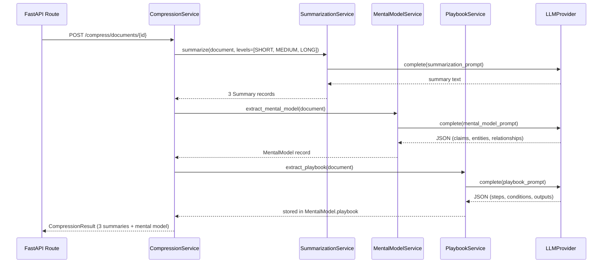

# Offline-First LLM Architecture: How I Built an AI System That Never Needs the Cloud

*A deep dive into the provider Protocol pattern, factory functions, and why "cloud-optional" is the right default.*

---

Most AI applications are built cloud-out. The OpenAI client gets wired in on day one. The model name is hardcoded. The API key is in the env file. And six months later, when the pricing changes, the rate limit is hit in production, or the model behavior shifts in a point release, the app breaks and the refactor is painful.

I built ECI the other way around. Offline is the default. Cloud is opt-in. Switching providers is a one-env-var change. Here's exactly how I designed it, why, and what I learned.

---

## The Problem with Cloud-First AI Design

Hardwiring a cloud LLM provider creates several failure modes:

1. **Rate limit surprises.** Your integration test suite hammers the API; you get throttled in CI at 2 AM before a release.
2. **Pricing drift.** A model you built a feature around gets deprecated or repriced. Your cost model is wrong.
3. **Behavioral drift.** OpenAI updates `gpt-4o-mini` silently. Your evals that passed last month now fail.
4. **Offline dev.** You're on a plane, in a coffee shop with spotty internet, or at a client site with strict egress rules. Your dev loop breaks.
5. **Vendor lock-in at the architecture layer.** Migrating from OpenAI to Anthropic requires touching every service that calls the LLM.

The solution is to treat the LLM as a dependency to be injected, not a library to be imported.

---

## The Provider Protocol Pattern

Python's `typing.Protocol` with `@runtime_checkable` gives us structural subtyping — duck typing with IDE and mypy support.

```python
from typing import Protocol, runtime_checkable

@runtime_checkable
class LLMProvider(Protocol):
    def complete(self, prompt: str, system: str = "", **kwargs: Any) -> str:
        ...

    def chat(self, messages: list[ChatMessage], **kwargs: Any) -> str:
        ...

    @property
    def model_name(self) -> str:
        ...
```



The critical design choice: **callers never import a concrete class**. They import the Protocol and the factory:

```python
# ✅ Correct — caller depends on the abstraction
from eci_llm import LLMProvider, create_llm_provider

provider: LLMProvider = create_llm_provider(config)
result = provider.complete(prompt="Summarize this document: ...")
```

```python
# ❌ Wrong — caller depends on the implementation
from eci_llm.ollama_provider import OllamaProvider

provider = OllamaProvider(host="http://localhost:11434", model="llama3.2")
```

The second pattern couples every caller to Ollama. You can't switch providers without touching every service.

---

## The Factory Function

The factory is the single place where the string `"ollama"` maps to an `OllamaProvider` instance:

```python
def create_llm_provider(config: LLMConfig | None = None) -> LLMProvider:
    cfg = config or load_llm_config()
    
    if cfg.provider == "ollama":
        return OllamaProvider(host=cfg.ollama_host, model=cfg.model)
    
    if cfg.provider == "openai":
        _require_package("openai", "eci-llm[openai]")
        from eci_llm.openai_provider import OpenAIProvider
        return OpenAIProvider(api_key=cfg.api_key, model=cfg.model)
    
    if cfg.provider == "anthropic":
        _require_package("anthropic", "eci-llm[anthropic]")
        from eci_llm.anthropic_provider import AnthropicProvider
        return AnthropicProvider(api_key=cfg.api_key, model=cfg.model)
    
    raise LLMConfigError(f"Unknown provider: {cfg.provider!r}")
```

Two things to notice:

**1. Lazy imports for optional dependencies.** `openai` and `anthropic` are not in the base requirements. They're optional extras. The import happens at instantiation time. If you haven't installed the package, you get a clear `LLMProviderNotAvailable` error with installation instructions — not a cryptic `ImportError` at module load time.

**2. Config-driven selection.** The `LLMConfig` is a Pydantic settings model with `env_prefix = "ECI_LLM_"`. Setting `ECI_LLM_PROVIDER=openai` is all you need to switch providers.

---

## The Offline Provider: OllamaProvider

`OllamaProvider` is the heart of AP-3. It uses only `httpx` — no Ollama Python SDK, just direct HTTP calls to the Ollama REST API. This keeps the dependency surface minimal and the behavior predictable.

```python
class OllamaProvider:
    def __init__(self, host: str, model: str) -> None:
        self._host = host.rstrip("/")
        self._model = model
        self._client = httpx.Client(base_url=self._host, timeout=120.0)

    def complete(self, prompt: str, system: str = "", **kwargs: Any) -> str:
        payload: dict[str, Any] = {
            "model": self._model,
            "prompt": prompt,
            "stream": False,
        }
        if system:
            payload["system"] = system
        
        response = self._client.post("/api/generate", json=payload)
        response.raise_for_status()
        return response.json()["response"]
```

The 120-second timeout matters. Mental model extraction on a long document through a 7B model can take 60+ seconds on CPU. The default `httpx` timeout of 5 seconds would fail silently.

---

## The Embedding Provider: Same Pattern

The same Protocol pattern applies to embeddings:

```python
@runtime_checkable
class EmbeddingProvider(Protocol):
    def embed(self, texts: list[str]) -> list[list[float]]:
        ...
    
    @property
    def dimension(self) -> int:
        ...
```

ECI uses `nomic-embed-text` via Ollama, producing 768-dimensional vectors. The HNSW index in Postgres is created for exactly this dimension. **Changing the dimension requires dropping and recreating the index** — a breaking change documented explicitly in the active context file.

---

## Testing Without an LLM

The biggest practical benefit of the provider Protocol: **stub LLMs for testing**.

```python
class StubLLMProvider:
    """Returns deterministic responses for unit/integration tests.
    No Ollama, no API key, no network."""
    
    def complete(self, prompt: str, system: str = "", **kwargs: Any) -> str:
        if "summarize" in prompt.lower():
            return "This is a test summary."
        if "mental model" in prompt.lower():
            return '{"claims": ["test claim"], "entities": [], "relationships": []}'
        return "stub response"
    
    def chat(self, messages: list[ChatMessage], **kwargs: Any) -> str:
        return "stub chat response"
    
    @property
    def model_name(self) -> str:
        return "stub"
```

The `StubLLMProvider` satisfies the Protocol structurally — no inheritance, no base class. This is passed into services in tests, giving us full integration test coverage (real Postgres, real SQL, real Alembic migrations) without requiring a running Ollama instance.

Three pytest markers govern this:
- `@pytest.mark.integration` — requires Postgres, uses `StubLLMProvider`
- `@pytest.mark.llm_integration` — requires both Postgres and Ollama
- *(no marker)* — unit tests, no external dependencies

CI runs `integration` on every PR via a Postgres service container. `llm_integration` runs only when the Ollama CI environment is available.

---

## Provider Comparison in Practice



| Scenario | Provider | Why |
|----------|----------|-----|
| Local dev, laptop | `ollama` + `llama3.2:3b` | Fast iteration, no cost, works offline |
| Local dev, GPU workstation | `ollama` + `llama3.2:latest` | Better quality, still offline |
| CI integration tests | `stub` | Deterministic, no Ollama required |
| CI llm tests | `ollama` (if runner has GPU) | End-to-end quality validation |
| Production, cost-sensitive | `ollama` + GPU server | Zero per-call cost after hardware |
| Production, quality-first | `openai` + `gpt-4o-mini` | Best quality, predictable latency |

---

## The Compression Pipeline in Action

The `CompressionService` orchestrates three stages, each using the provider:



Each stage emits an OTel span. LLM malformation (invalid JSON) degrades gracefully — partial evidence is better than no evidence (AP-2). The retrospective completes with 0 lessons rather than raising if the LLM returns garbage.

---

## What the Config Looks Like

```python
class LLMConfig(BaseSettings):
    provider: Literal["ollama", "openai", "anthropic", "openrouter"] = "ollama"
    model: str = "llama3.2"
    ollama_host: str = "http://localhost:11434"
    api_key: str = ""
    temperature: float = 0.1
    max_tokens: int = 4096

    model_config = SettingsConfigDict(
        env_prefix="ECI_LLM_",
        env_file=".env",
    )
```

`ECI_LLM_PROVIDER=anthropic ECI_LLM_API_KEY=sk-ant-... ECI_LLM_MODEL=claude-haiku-4-5-20251001` — that's the entire migration from Ollama to Anthropic. No code change.

---

## Lessons

**1. The Protocol is the contract, not the implementation.** When you write code against the Protocol, you're writing against the intent. Any provider that satisfies the intent works.

**2. Lazy imports are worth the complexity.** The alternative is making every developer install `openai` and `anthropic` even if they only use Ollama. Lazy imports make the default case clean.

**3. Offline-first inverts your testing pyramid.** If the default is Ollama and the test default is a stub, your integration tests never wait on network. CI is faster, more deterministic, and cheaper.

**4. 120-second timeouts.** Always. LLM calls on underpowered hardware are slow. A 5-second timeout is a lie you tell yourself.

---

*Next in this series: building a citation-first retrieval system — hybrid search, RRF, and why "no answer without provenance" is an architectural invariant, not a convention.*

---

**Tags:** `#LLMEngineering` `#PythonArchitecture` `#OfflineFirst` `#AIInfrastructure` `#DesignPatterns` `#Ollama` `#FastAPI`
