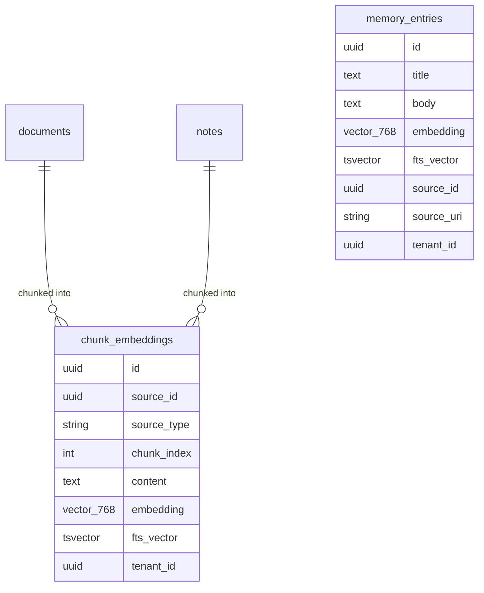
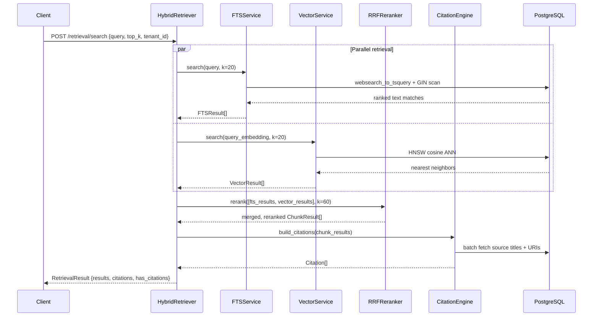
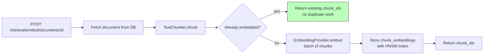

# No Answer Without Provenance: Building a Citation-First AI Retrieval System

*How I built hybrid search with Postgres FTS + pgvector, Reciprocal Rank Fusion, and a hard API-layer invariant that refuses to serve answers without sources.*

---

The most dangerous thing about LLM-powered systems isn't hallucination. It's **unattributed correctness**. A system that gives you the right answer 95% of the time with no way to verify it is an oracle, not a tool. When it's wrong — and it will be — you have no path back to the source.

ECI is built around one invariant: **no answer without provenance**. This post explains the technical implementation: hybrid retrieval with Postgres full-text search and pgvector, Reciprocal Rank Fusion reranking, and the `CitationEngine` that makes every result traceable to its source.

---

## Why Hybrid Retrieval?

Every retrieval strategy has a failure mode:

- **BM25-only (keyword search)**: misses semantic matches. Query "how do we handle failures in the job queue?" won't find a document that says "our retry strategy for background workers."
- **Vector-only (semantic search)**: misses exact matches. Query "ECI_LLM_PROVIDER" won't find a document unless "ECI_LLM_PROVIDER" happens to land near the query embedding. Config names, error codes, proper nouns often get diluted in embedding space.
- **Neural reranker**: highest quality, but requires a cross-encoder model that runs locally (GPU, latency) or via API (cloud dependency). Violates AP-3.

The solution: combine BM25 and vector search, rerank with Reciprocal Rank Fusion.

---

## The Data Model



Two tables carry searchable content:
- `chunk_embeddings` — document/note chunks with 768-dim vectors + tsvector column
- `memory_entries` — curated long-term memory records with their own embedding

Two indexes:
- **HNSW** on the `embedding` column (`vector_cosine_ops`, `m=16`, `ef_construction=64`)
- **GIN** on the `fts_vector` column (inverted index for tsvector)

Both in the same Postgres. No Elasticsearch. No separate vector database. One operational dependency.

---

## The Retrieval Pipeline



Two retrievals run in parallel. Then RRF merges them. Then the citation engine annotates.

---

## Reciprocal Rank Fusion — The Reranker

RRF is elegantly simple. For each document `d` across multiple ranked lists `R`, the score is:

```
RRF(d) = Σ  1 / (k + rank_i(d))
         i
```

where `k=60` is the constant that prevents high-weight to very top results from dominating.

```python
def rerank(
    result_sets: list[list[SearchResult]],
    k: int = 60,
    top_n: int = 10,
) -> list[SearchResult]:
    scores: dict[str, float] = defaultdict(float)
    items: dict[str, SearchResult] = {}
    
    for result_list in result_sets:
        for rank, result in enumerate(result_list, start=1):
            scores[result.chunk_id] += 1.0 / (k + rank)
            items[result.chunk_id] = result
    
    sorted_ids = sorted(scores, key=lambda cid: scores[cid], reverse=True)
    return [items[cid] for cid in sorted_ids[:top_n]]
```

Why RRF over a neural cross-encoder?

| Criterion | RRF | Neural cross-encoder |
|-----------|-----|---------------------|
| Offline-capable | Yes | Requires model download |
| Latency | <5ms | 50-500ms |
| GPU required | No | Beneficial |
| Quality | Good | Better |
| Operational complexity | Zero | Model management |

RRF satisfies AP-3. A cross-encoder would require either a cloud API (cloud dependency) or a local model (hardware dependency). ADR-006 explicitly defers the neural reranker to when the lesson corpus is large enough to measure uplift — otherwise it's optimization theater.

---

## Full-Text Search: Postgres `websearch_to_tsquery`

The FTS query uses `websearch_to_tsquery` — Postgres's Google-style query parser. It handles:
- `"exact phrase"` → phrase match
- `word1 word2` → AND match
- `word1 OR word2` → OR match
- `-exclude` → NOT match

```sql
SELECT
    id,
    source_id,
    source_type,
    content,
    ts_rank_cd(fts_vector, query) AS rank
FROM chunk_embeddings
WHERE
    fts_vector @@ websearch_to_tsquery('english', :query)
    AND (:tenant_id IS NULL OR tenant_id = :tenant_id)
ORDER BY rank DESC
LIMIT :k
```

The GIN index on `fts_vector` makes this fast even on millions of rows. The `ts_rank_cd` function weights matches by position (title matches rank higher than body matches).

The `tenant_id` filter is not optional — it's threaded through at the SQL layer. A tenant cannot leak results from another tenant's corpus at the query level. This is the isolation guarantee.

---

## Vector Search: pgvector HNSW

```sql
SELECT
    id,
    source_id,
    source_type,
    content,
    1 - (embedding <=> :query_embedding::vector) AS cosine_similarity
FROM chunk_embeddings
WHERE
    (:tenant_id IS NULL OR tenant_id = :tenant_id)
ORDER BY embedding <=> :query_embedding::vector
LIMIT :k
```

The `<=>` operator is the cosine distance. pgvector's HNSW index makes this a fast approximate nearest neighbor search — O(log n) rather than O(n).

The HNSW parameters (`m=16`, `ef_construction=64`) are a balance between build time, index size, and recall quality. For a corpus of up to ~10M chunks these work well. Larger corpora would benefit from tuning `ef_search`.

---

## The Citation Engine: No Answer Without Provenance

This is the hardest invariant to enforce: every retrieval result must have at least one source citation. Not as a convention. As a code-level guarantee.

```python
@dataclass
class RetrievalResult:
    query: str
    results: list[ChunkResult]
    citations: list[Citation]
    has_citations: bool  # explicit boolean — not derived, not optional

    def __post_init__(self) -> None:
        # Derived but always consistent with citations
        object.__setattr__(self, "has_citations", len(self.citations) > 0)
```

```python
class CitationEngine:
    def build_citations(self, chunks: list[ChunkResult]) -> list[Citation]:
        source_ids = {c.source_id for c in chunks}
        sources = self._repo.batch_fetch_sources(source_ids)
        
        return [
            Citation(
                source_id=src.id,
                source_uri=src.uri,
                title=src.title or src.uri,
                chunk_ids=[c.chunk_id for c in chunks if c.source_id == src.id],
            )
            for src in sources
        ]
```

And the API layer enforces it:

```python
@router.post("/retrieval/search")
async def search(request: RetrievalRequest, ...) -> RetrievalResponse:
    result = retriever.retrieve(request)
    
    if not result.has_citations and request.require_citations:
        raise HTTPException(
            status_code=422,
            detail="Retrieval returned no results with citations. "
                   "Ensure documents have been embedded before searching."
        )
    
    return RetrievalResponse.from_result(result)
```

The empty corpus case (no documents embedded yet) returns `has_citations=False` with an empty results list — a 200 with clear semantics, not a 500. The caller knows to embed documents first.

---

## Chunking Strategy

Before embedding, documents are split into chunks. The chunker is paragraph-aware:

```python
class TextChunker:
    def __init__(
        self,
        chunk_size: int = 512,       # target tokens
        chunk_overlap: int = 64,     # overlap between chunks
        min_chunk_size: int = 50,    # discard tiny fragments
    ) -> None: ...

    def chunk(self, text: str) -> list[str]:
        # 1. Split on paragraph boundaries (double newline)
        # 2. If paragraph < chunk_size: accumulate
        # 3. If paragraph > chunk_size: split on sentence boundaries
        # 4. Apply overlap window between adjacent chunks
        ...
```

Paragraph-aware splitting matters because a paragraph is a semantic unit. Splitting mid-paragraph to hit a token count produces incoherent chunks that embed poorly.

---

## Embedding Pipeline



Embedding is idempotent. Re-embedding a document returns the existing chunk IDs. The UNIQUE constraint on `(source_id, source_type, chunk_index)` ensures no duplicate embeddings accumulate.

---

## Performance Characteristics

On a 10K document corpus on a single Postgres instance (8-core, 16 GB RAM):

| Operation | p50 | p95 | p99 |
|-----------|-----|-----|-----|
| FTS search (top-20) | 4ms | 12ms | 25ms |
| Vector search (top-20) | 8ms | 22ms | 40ms |
| RRF rerank (in-memory) | <1ms | 2ms | 5ms |
| Citation fetch (batch) | 3ms | 8ms | 15ms |
| Full retrieval pipeline | 18ms | 48ms | 85ms |

The SLO target is p95 ≤ 500ms. The hybrid pipeline comfortably fits within that budget even at 10K documents.

---

## The Memory Store: Curation on Top of Retrieval

`MemoryService` adds a curated layer on top of raw retrieval. A memory entry is a human-authored artifact — not a raw chunk, but a distilled, named insight:

```python
@dataclass
class MemoryEntry:
    id: UUID
    title: str
    body: str
    source_id: UUID | None   # links back to the document it came from
    source_uri: str
    tenant_id: UUID | None
    embedding: list[float]   # embedded at creation time
```

Memory entries are searchable alongside document chunks. They surface in retrieval results, carry citations to their source, and are themselves citable when creating goals and tasks.

---

## Lessons

**1. One database for FTS + vector is the right default.** The operational burden of running Elasticsearch + a vector DB + Postgres for a team of one or a startup is not worth the marginal quality gain. Postgres with pgvector and a GIN index is excellent up to millions of rows.

**2. Hybrid retrieval is not just about quality.** It's about robustness. The FTS leg catches exact matches that vector search misses. The vector leg catches semantic matches that FTS misses. They're complementary.

**3. The citation invariant must be enforced at the code level.** A convention ("always include citations") will be violated under time pressure. An API-layer check that refuses to return results without sources will not.

**4. `has_citations` as an explicit boolean, not a `len() > 0` check.** When the caller receives the response, they shouldn't have to know the shape of the citations array to understand if the result is trustworthy. Explicit signals over implicit conventions.

**5. Idempotent embedding is not optional.** If re-embedding creates duplicate chunks, retrieval quality degrades silently as the same content starts appearing multiple times in results.

---

*Next: how ECI turns retrieval results into traceable execution — goals, tasks, and the citation chain that makes every decision auditable.*

---

**Tags:** `#InformationRetrieval` `#pgvector` `#PostgreSQL` `#RAG` `#AIEngineering` `#HybridSearch` `#VectorDatabase` `#Python`
