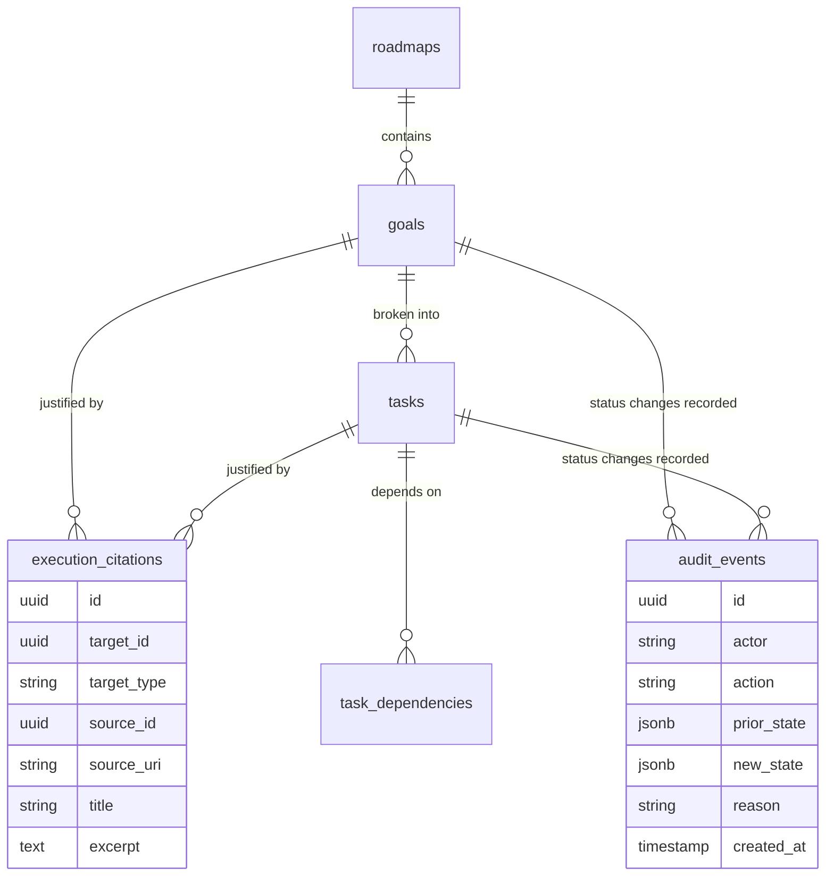
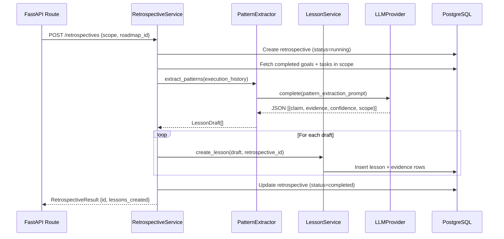
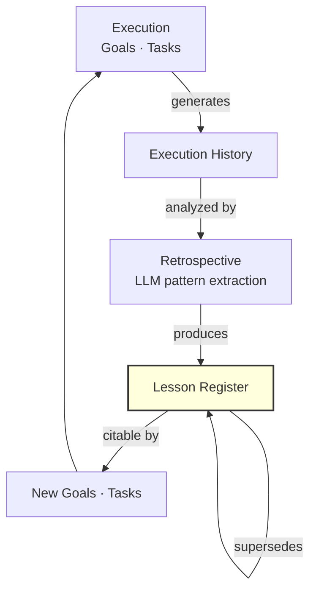

# From Memory to Action: Execution Intelligence and the Reflection Engine

*How goals, tasks, and roadmaps inherit the evidence trail that justifies them — and how retrospectives turn execution history into compounding institutional knowledge.*

---

Most task management systems answer "what" and "when". They don't answer "why." You can see that a task exists and when it's due, but not what evidence motivated it, what decision it traces back to, or what the team learned when it was completed.

ECI's execution layer is designed around a different question: **if I ask "why does this task exist?" a year from now, can the system give me a real answer?**

This post covers two phases — execution intelligence (P5) and the reflection engine (P6) — and how they work together to create institutional memory that compounds.

---

## The Citation Chain: Inherited at Creation

The fundamental design of ECI's execution domain: **every goal and task inherits the citation chain from the retrieval result that motivated it**.

This is not metadata-after-the-fact. When a client creates a goal, it submits the citations from the retrieval search that led to the decision:

```python
class GoalCreate(BaseModel):
    roadmap_id: UUID
    title: str
    description: str
    citations: list[CitationInput] = []   # sourced from /retrieval/search


class CitationInput(BaseModel):
    source_id: UUID
    source_uri: str
    title: str
    excerpt: str   # the specific passage that was relevant
```

These citations are stored as `ExecutionCitation` rows linked to the goal. They're never regenerated, never re-retrieved — they're stored at creation time, deterministic, and auditable.



---

## The "Why" Endpoints

The endpoints `GET /goals/{id}/why` and `GET /tasks/{id}/why` return the pre-stored citations:

```python
@router.get("/goals/{goal_id}/why")
async def why_goal(goal_id: UUID, ...) -> WhyResponse:
    citations = goal_service.get_citations(goal_id)
    return WhyResponse(
        target_id=goal_id,
        target_type="goal",
        citations=citations,   # list[Citation], possibly empty
        has_citations=len(citations) > 0,
    )
```

No live retrieval. No LLM call. The answer is deterministic and instant because it was stored at creation time. A year from now, the citations point to the same source records — and if those records have been updated, the original excerpt is preserved in the citation row.

---

## The Audit Log: Every Status Change Recorded

Status changes are audited via the shared `AuditEvent` table — the same table used by the reflection engine and the RBAC system:

```python
def update_status(
    goal_id: UUID,
    new_status: GoalStatus,
    actor: str,
    reason: str = "",
    session: Session,
) -> Goal:
    goal = session.get(Goal, goal_id)
    prior_status = goal.status
    
    goal.status = new_status
    
    audit_service.record(
        session=session,
        actor=actor,
        action="goal.status_change",
        prior_state={"status": prior_status.value},
        new_state={"status": new_status.value},
        target_id=goal_id,
        target_type="goal",
        reason=reason,
    )
    
    session.flush()
    return goal
```

The audit log is append-only and queryable. It's itself a knowledge artifact — the history of decisions is as important as the decisions themselves.

---

## Task Dependencies: Cycle-Safe by Design

The task dependency graph is a DAG. Adding a cycle would make the system unresolvable. ECI enforces this at the database boundary with BFS cycle detection before every insert:

```python
def add_dependency(
    task_id: UUID,
    depends_on_id: UUID,
    session: Session,
) -> TaskDependency:
    # Check that depends_on_id is not reachable from task_id
    # (which would create a cycle if we add task_id → depends_on_id)
    if _would_create_cycle(task_id, depends_on_id, session):
        raise DependencyCycleError(
            f"Adding {task_id} → {depends_on_id} would create a cycle"
        )
    
    dep = TaskDependency(task_id=task_id, depends_on_id=depends_on_id)
    session.add(dep)
    session.flush()
    return dep

def _would_create_cycle(start: UUID, target: UUID, session: Session) -> bool:
    visited: set[UUID] = set()
    queue: deque[UUID] = deque([target])
    
    while queue:
        node = queue.popleft()
        if node == start:
            return True
        if node in visited:
            continue
        visited.add(node)
        deps = session.execute(
            select(TaskDependency.depends_on_id)
            .where(TaskDependency.task_id == node)
        ).scalars().all()
        queue.extend(deps)
    
    return False
```

BFS is O(V+E) — linear in the size of the dependency graph. For typical roadmaps (tens to hundreds of tasks), this is negligible.

---

## Phase 6: The Reflection Engine

Execution produces a history. Reflection turns that history into structured lessons.



The retrospective is synchronous. The LLM call happens inline. This is a deliberate trade-off: synchronous is simpler, auditable, and testable. Async cadence (scheduled weekly runs) is deferred — it requires a job queue, which is infrastructure cost that the current phase doesn't need.

LLM malformation is tolerated. If the LLM returns malformed JSON or an empty array, the retrospective completes with 0 lessons and status `completed`. The caller can always create lessons manually. Partial evidence is better than a failure (AP-2).

---

## The Lesson Register

A `Lesson` is a first-class knowledge artifact:

```python
class Lesson(Base):
    __tablename__ = "lessons"
    
    id: UUID
    claim: str                    # the lesson statement
    confidence: LessonConfidence  # LOW / MEDIUM / HIGH
    scope: str                    # "retrieval", "execution", "process", etc.
    retrospective_id: UUID        # traces back to the run that created it
    supersedes_id: UUID | None    # if this supersedes a prior lesson
    status: LessonStatus          # active / superseded / archived
    tenant_id: UUID | None
```

The `LessonEvidence` table stores the execution events that support the claim — whole goal/task pointers plus a human-readable explanation of why they support it. This is coarser than retrieval chunks — evidence for lessons is a narrative, not a snippet.

---

## Lesson Supersession: Institutional Memory That Updates

Lessons go stale. A lesson from 2 years ago about how to deploy a service might be wrong today. ECI models this explicitly:

```python
def supersede_lesson(
    lesson_id: UUID,
    new_claim: str,
    evidence: list[EvidenceInput],
    actor: str,
    session: Session,
) -> Lesson:
    old_lesson = session.get(Lesson, lesson_id)
    
    # Create new lesson
    new_lesson = Lesson(
        claim=new_claim,
        supersedes_id=lesson_id,
        retrospective_id=old_lesson.retrospective_id,  # preserve lineage
        ...
    )
    session.add(new_lesson)
    
    # Mark old lesson superseded
    old_lesson.status = LessonStatus.SUPERSEDED
    
    # Audit trail
    audit_service.record(
        actor=actor,
        action="lesson.superseded",
        prior_state={"lesson_id": str(lesson_id), "claim": old_lesson.claim},
        new_state={"lesson_id": str(new_lesson.id), "claim": new_claim},
    )
    
    return new_lesson
```

The supersession chain is queryable. You can trace the evolution of institutional understanding: "this lesson replaced that one, which replaced this one from 3 years ago." That's not possible with a wiki page that gets overwritten.

---

## The Compounding Returns of Reflection



The reflection loop is where institutional memory compounds. Each retrospective adds lessons that become citable evidence for the next cycle of goals. A team that runs weekly retrospectives for a year accumulates a structured, searchable, versioned record of what they learned — not blog posts, not meeting notes, but typed evidence with lineage.

---

## What the Integration Tests Verify

The 17 integration tests for P5+P6 cover the invariants that matter:

```python
def test_goal_why_returns_stored_citations(db_session, ...):
    """Citations are stored at creation, not retrieved live."""
    goal = goal_service.create(GoalCreate(
        title="Improve retrieval quality",
        citations=[CitationInput(source_id=doc.id, ...)]
    ), session=db_session)
    
    result = goal_service.get_citations(goal.id, session=db_session)
    assert len(result) == 1
    assert result[0].source_id == doc.id


def test_add_dependency_raises_on_cycle(db_session, ...):
    """BFS cycle detection blocks circular dependencies."""
    task_a, task_b = create_two_tasks(db_session)
    task_service.add_dependency(task_b.id, task_a.id, session=db_session)
    
    with pytest.raises(DependencyCycleError):
        task_service.add_dependency(task_a.id, task_b.id, session=db_session)


def test_lesson_supersession_audit_trail(db_session, ...):
    """Supersession leaves an audit record with both claims."""
    lesson = lesson_service.create(...)
    new_lesson = lesson_service.supersede(lesson.id, new_claim="Updated lesson", ...)
    
    events = audit_service.list(target_id=lesson.id, session=db_session)
    assert any(e.action == "lesson.superseded" for e in events)
    assert events[0].prior_state["claim"] == lesson.claim
```

Real Postgres, no mocks, transactional fixtures that roll back after each test.

---

## Lessons

**1. Store citations at creation time.** Don't try to reconstruct "why this decision was made" from retrieval history. Store the evidence when the decision is made. It's cheap, deterministic, and always available.

**2. The audit log is a knowledge artifact.** Don't treat it as a security audit trail only. It's also the history of how the system's understanding evolved. Make it queryable.

**3. Sync retrospectives are the right starting point.** Async job queues are complex to operate. A synchronous endpoint that takes 5-10 seconds is acceptable for a feature that runs at most weekly.

**4. Model lesson evolution, not lesson replacement.** Overwriting a lesson destroys lineage. Supersession creates a versioned chain. That chain is itself institutional knowledge.

**5. LLM tolerance is not optional.** If your reflection engine throws a 500 when the LLM returns malformed JSON, you've made the LLM a hard dependency of a flow that should be robust. Fail soft. Log the malformation. Let the user create lessons manually.

---

*Next: production hardening — how ECI got from "working code" to a GA system with SLOs, eval gates, a security CI pipeline, and a DR runbook.*

---

**Tags:** `#SoftwareEngineering` `#SystemDesign` `#KnowledgeManagement` `#AIEngineering` `#Python` `#PostgreSQL` `#ProductManagement` `#AuditLog`
