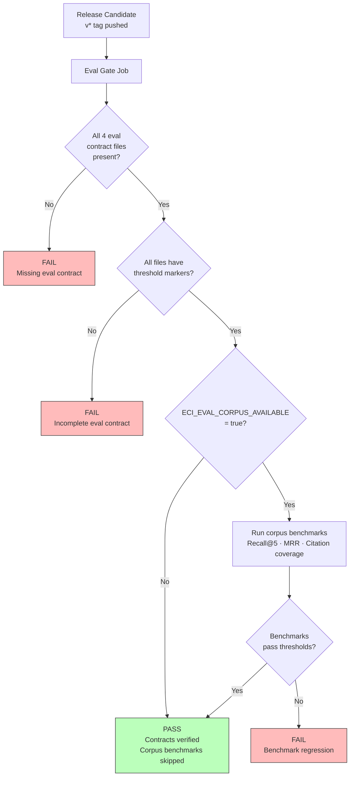
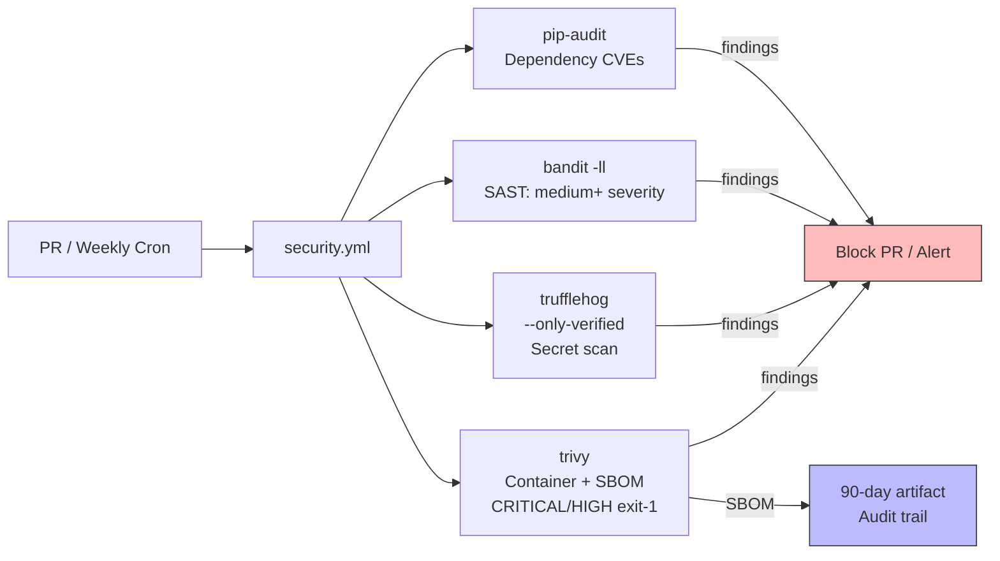
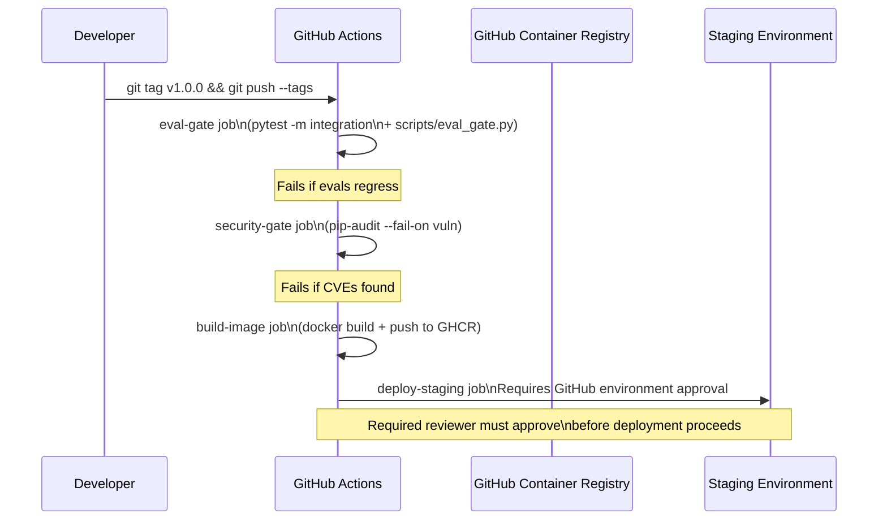
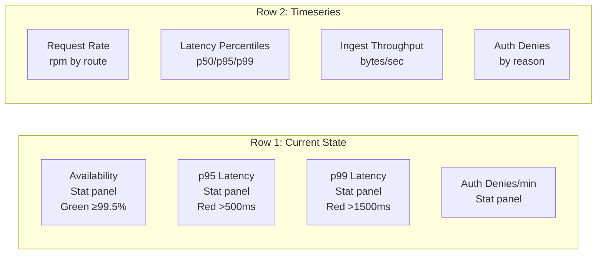
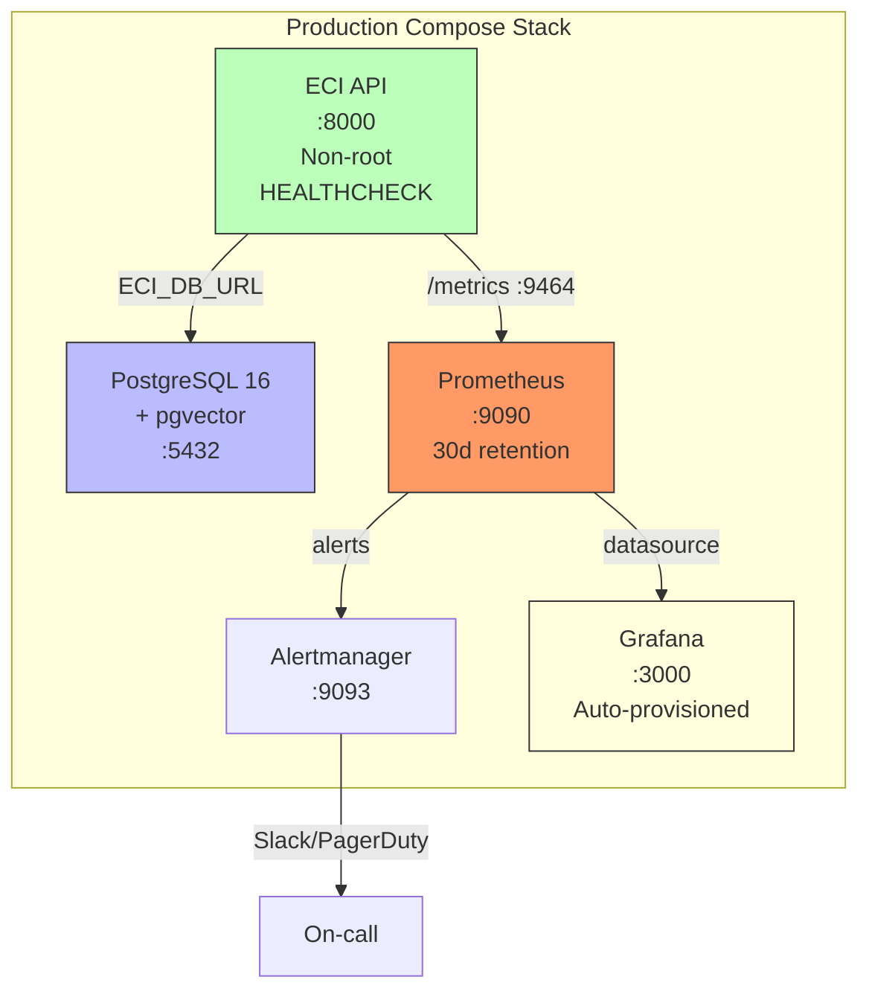

# Production-Hardening an AI System: SLOs, Eval Gates, and the Security CI Pipeline

*What it actually takes to go from "working code" to a GA-ready system — and why AI systems need an eval gate the same way traditional systems need integration tests.*

---

Most side projects die in the gap between "it works on my machine" and "it runs reliably in production." That gap is larger for AI systems than for traditional software, because AI systems have a failure mode that traditional tests don't catch: **behavioral regression**. The code is correct, the tests pass, but the model behavior changed and the answers got worse.

This post covers Phase 8 of ECI — production hardening — and specifically four things I think every production AI system needs but most tutorials skip: SLO definitions, eval gates, a multi-layer security CI pipeline, and a disaster recovery runbook with a mandatory drill.

---

## What "Production-Ready" Actually Means

I'll define it concretely. A system is production-ready when:

1. You know what "working" looks like, measured continuously (SLOs)
2. Regressions are caught before release, not by users (eval gate)
3. The security posture is verified automatically, not manually (security CI)
4. You can recover from a full data loss within your RTO (DR runbook + drill)

Let's go through each.

---

## SLOs: Defining "Working"

An SLO without a measurement infrastructure is a promise. An SLO with Prometheus + Grafana + Alertmanager is a contract.

ECI has five SLOs:

| SLO | Target | Measurement |
|-----|--------|-------------|
| Availability | ≥ 99.5% | `1 - error_rate` over 5-minute windows |
| Latency p95 | ≤ 500ms | `histogram_quantile(0.95, rate(eci_request_latency_seconds_bucket[5m]))` |
| Latency p99 | ≤ 1500ms | `histogram_quantile(0.99, ...)` |
| Citation coverage | 100% | Eval gate (not Prometheus — requires corpus) |
| Retrieval Recall@5 | ≥ 0.70 | Eval gate |

The first three are measured continuously in Prometheus. The last two are measured by the eval gate on every release candidate.

```mermaid
graph LR
    A[FastAPI\nRequest] --> B[prometheus_client\nHistogram + Counter]
    B --> C[/metrics endpoint\nport 9464]
    C --> D[Prometheus\nScrapes every 10s]
    D --> E[Alert Rules\neci.yml]
    D --> F[Grafana\nSLO Dashboard]
    E --> G[Alertmanager\nRouting + Inhibit]
    G --> H[Slack / PagerDuty\ncritical: 1h repeat]
```

---

## The Alert Rules

Six alert rules in `infra/prometheus/alerts/eci.yml`:

```yaml
- alert: ECILowAvailability
  expr: |
    (
      sum(rate(eci_requests_total{outcome="success"}[5m]))
      /
      sum(rate(eci_requests_total[5m]))
    ) < 0.995
  for: 5m
  labels:
    severity: critical
  annotations:
    summary: "ECI availability dropped below 99.5%"

- alert: ECIHighLatencyP95
  expr: |
    histogram_quantile(0.95,
      sum(rate(eci_request_latency_seconds_bucket[5m])) by (le)
    ) > 0.5
  for: 5m
  labels:
    severity: warning

- alert: ECIHighLatencyP99
  expr: |
    histogram_quantile(0.99,
      sum(rate(eci_request_latency_seconds_bucket[5m])) by (le)
    ) > 1.5
  for: 5m
  labels:
    severity: critical
```

The `for: 5m` clause prevents flapping. An alert fires only if the condition holds for 5 consecutive minutes.

---

## Eval Gates: The AI-Specific Release Blocker

Traditional software blocks releases on: failing tests, lint errors, type errors. These checks verify **code correctness**.

AI systems need an additional check: **behavioral correctness**. Did the LLM integration produce outputs that meet quality thresholds? Did the retrieval quality regress?

ECI's eval gate is `scripts/eval_gate.py`:



The four required eval contract files:
- `evaluations/ingestion-correctness.md` — 100% round-trip, idempotency, provenance
- `evaluations/summarization-faithfulness.md` — faithfulness ≥ 0.85, coverage ≥ 0.75
- `evaluations/retrieval-benchmarks.md` — Recall@5 ≥ 0.70, MRR ≥ 0.60, citation 100%
- `evaluations/reflection-quality.md` — accuracy ≥ 0.80, specificity ≥ 0.75

The eval gate fails the release if:
1. Any of these files is missing
2. Any file lacks the required threshold markers
3. Corpus benchmarks are available and don't pass

This enforces a discipline: you can't ship a new phase without defining what "good" looks like, in writing, with numbers.

---

## The Security CI Pipeline

Four tools, two triggers (every PR + weekly cron):



### pip-audit — Dependency CVE Scan

```yaml
- name: Dependency CVE scan
  run: pip-audit --requirement requirements.txt --output json > audit.json
  continue-on-error: false
```

Blocks on HIGH or CRITICAL severity CVEs in the dependency tree. Runs before any code reaches the container.

### bandit — SAST

```bash
bandit -ll -r apps/ packages/ -f json -o bandit-report.json
```

`-ll` means medium or higher severity. It catches: hardcoded passwords, shell injection via `subprocess`, SQL injection via string formatting, weak cryptography.

The `apps/` + `packages/` scope matters. Scanning only `apps/` would miss package-level issues. Scanning `tests/` would generate false positives on `assert` usage.

### trufflehog — Secret Scan

```yaml
- uses: trufflesecurity/trufflehog@v3
  with:
    extra_args: --only-verified
```

`--only-verified` flag means only report secrets that can be verified against the provider (GitHub, AWS, etc.). Without this flag, high false positive rate. With it, zero false positives in practice for most repos.

### trivy — Container Scan + SBOM

```yaml
- name: Container scan
  uses: aquasecurity/trivy-action@master
  with:
    image-ref: ghcr.io/${{ github.repository }}:${{ github.sha }}
    exit-code: '1'
    severity: 'CRITICAL,HIGH'
    format: 'cyclonedx'
    output: 'sbom.json'

- name: Upload SBOM
  uses: actions/upload-artifact@v4
  with:
    name: sbom-${{ github.sha }}
    path: sbom.json
    retention-days: 90
```

The SBOM (Software Bill of Materials) in CycloneDX format is retained as a 90-day artifact. This is the audit trail for compliance questions: "what exact packages were running on this date?"

---

## The Release Pipeline



The staging environment in GitHub Actions requires a human approval before deployment. This is the last gate — a human must review the eval results, the security scan results, and approve the deploy. Automation handles quality checks; humans handle the deploy decision.

---

## Disaster Recovery

### The Runbook: RTO 2h, RPO 24h

The DR runbook answers three questions:
1. How do we back up?
2. How do we restore?
3. How do we know the restore worked?

**Backup procedure (daily, automated):**
```bash
pg_dump -h $DB_HOST -U eci -d eci \
  | gzip \
  | aws s3 cp - s3://$BACKUP_BUCKET/postgres/eci_$(date +%Y%m%d_%H%M%S).sql.gz
```

Cross-region replication on the S3 bucket via S3 Replication Rules. Blobs are already in S3 (after P8) — they're inherently replicated if cross-region replication is configured on the bucket.

**Restore procedure (tested in DR drills):**
```bash
# 1. Identify latest backup
aws s3 ls s3://$BACKUP_BUCKET/postgres/ --recursive | sort | tail -1

# 2. Download + restore
aws s3 cp s3://$BACKUP_BUCKET/postgres/eci_<latest>.sql.gz - \
  | gunzip \
  | psql -h $NEW_DB_HOST -U eci -d eci

# 3. Run migrations to handle any pending schema changes
alembic -c packages/storage/alembic.ini upgrade head

# 4. Verify integrity
python scripts/verify_restore.py --count-records --check-citations
```

### The DR Drill: The Part Everyone Skips

The runbook is not enough. The drill is where you find out the backup was corrupt, the restore script has a typo, or the RTO estimate was optimistic.

ECI has an 8-step drill protocol:
1. Announce maintenance window (15 min)
2. Take a fresh backup and verify checksum
3. Spin up a fresh Postgres instance (different host)
4. Restore from the fresh backup
5. Run the integrity verification script
6. Spot-check: can you search? Can you retrieve with citations?
7. Record actual RTO (time from "incident declared" to "service verified")
8. Log findings in the drill log in the runbook

The first drill is scheduled within 2 weeks of GA deployment. If you've never run the drill, you don't have DR — you have a hope.

---

## The Grafana SLO Dashboard

Eight panels, auto-provisioned:



The dashboard is provisioned via a JSON file in `infra/grafana/dashboards/eci-slo.json`. It requires no manual setup — start `docker-compose.prod.yml` and it's there.

---

## Putting It All Together: The Production Stack



One `docker compose up` command. Five services. All volumes named and persistent. All configs provisioned. No manual steps.

---

## Why the Eval Gate Changes How You Write Code

The most significant cultural change from building the eval gate: **defining "done" requires defining "good".**

Before writing the compression pipeline (P3), I had to define: "What's a faithful summary?" and answer it with a number. Before writing the retrieval pipeline (P4): "What's acceptable recall?" This forces precision about intent that vague acceptance criteria don't.

The eval gate also prevents a specific failure mode: shipping a working implementation that degrades a previous working implementation. Without it, you can break citation coverage on retrieval while adding a new feature to compression — and the tests don't catch it because they test behavior, not quality.

---

## Lessons

**1. Define SLOs before you build observability.** The SLO definition determines what you instrument. If you build observability first, you instrument what's easy, not what matters.

**2. The eval gate is not optional for AI systems.** Code tests verify correctness. Eval gates verify quality. An AI system without an eval gate is a system where quality regressions go undetected until a user reports them.

**3. The security pipeline should run on every PR.** A weekly dependency scan catches CVEs a week late, by which point you might have shipped a vulnerable container to production. PR-level checks catch them before they ship.

**4. The DR drill is the real test.** The backup script is not disaster recovery. The restore script is not disaster recovery. A completed, documented drill with a recorded RTO is disaster recovery.

**5. Auto-provisioned dashboards or no dashboards.** A dashboard that requires manual setup will be different in every environment. JSON-provisioned dashboards are reproducible, version-controlled, and correct everywhere.

---

*This is the final post in the ECI series. The full source code, all 10 ADRs, eval contracts, SLO definitions, and DR runbook are on GitHub.*

---

**Tags:** `#SRE` `#DevOps` `#AIEngineering` `#ProductionSystems` `#Prometheus` `#Grafana` `#SLO` `#SecurityCI` `#DisasterRecovery` `#Python` `#MLOps`
